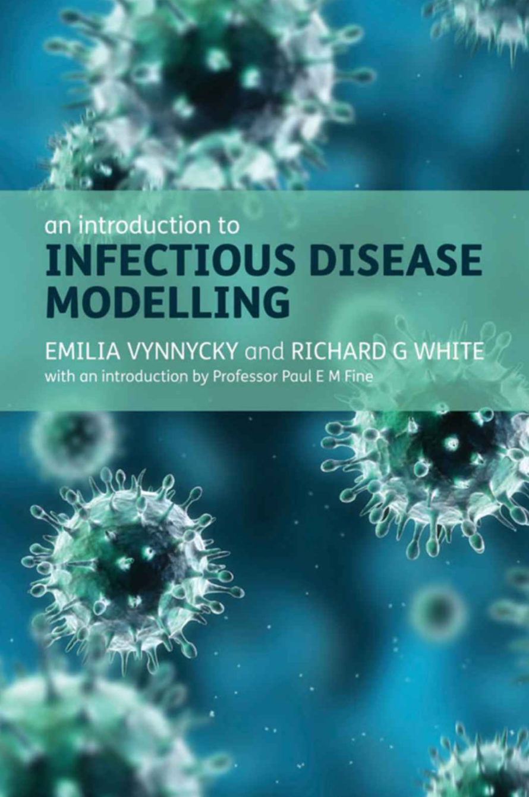
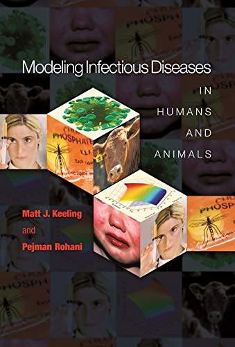
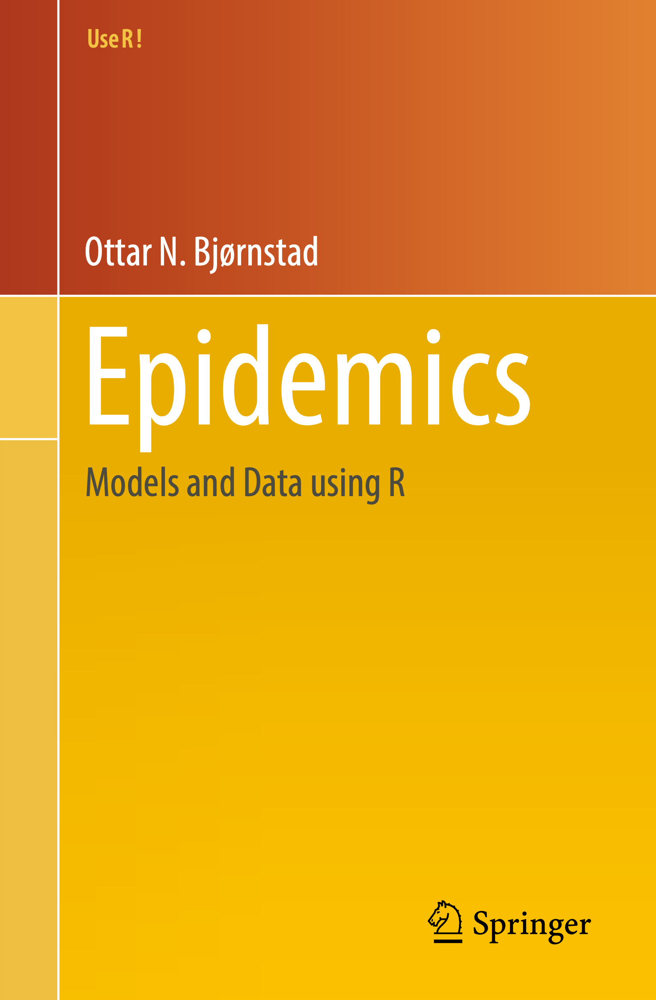
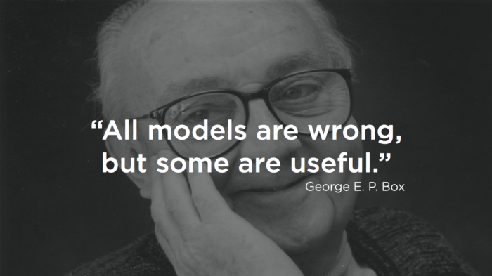
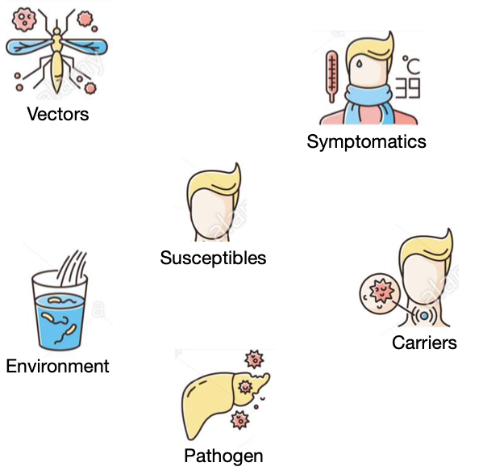
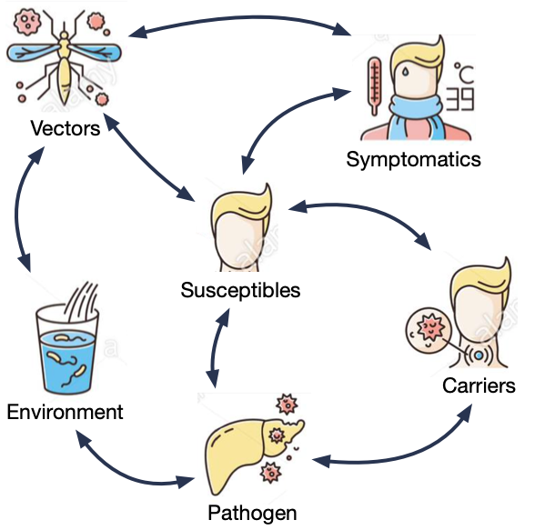
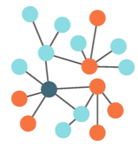
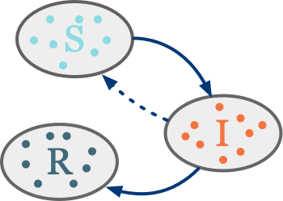
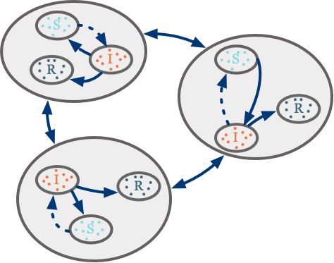

```{r, include=FALSE}
knitr::opts_chunk$set(message = FALSE, dpi = 400)
```

class: split-50 title-slide

.row.body[
	.split-75[
		.column[.content[
				<h2>Introduction to</h2>
				<h1>Infectious<br>Disease Modeling</h1>
				<h4>Angelo D'Ambrosio, MD</h4>
				<h5>Institute for Infection Prevention and Hospital Hygiene<br>Freiburg University Hospital, Freiburg, Germany</h5>
				<br>
				<h5>a.dambrosioMD@gmail.com, angelo</h5>
				]]
		.column.img-fill[
			
		]
	]
]
.row.img-fill.banner[
	
]

---

class: middle

## Outline

- Overview of compartmental (e.g., SIR) models and few extensions.
- Show how to get epidemiological insights from mathematical models.
- Some practical examples using R.

---

class: three-images

## Resources

.center[

]

---

class: middle inverse

# What does it mean to model

### and why it is important...

---
class: split-two, middle

.column[.content[

## Models are "useful" simplification of reality

Why useful?
- understand phenomena
- decompose their components
- make predictions

Quantitative models (mathematical/statistical) have the advantage to allow
**numerical predictions** that can be verified and fitted with **real data**.

.blockquote[**Models are as good as the prediction they make**]
]]

.column.img-contain[

]

---

.pull-left[

 ## Two approaches

  ### Top-down
  Start from the data and build a model that fit them well.
  
  Easier to build, rely more on statistical/data science skill than domain knowledge.
  
  May not generalize well outside observed data and may have not a natural interpretation.
  
  Examples: hypothesis testing, regression modeling, machine learning.
]

.pull-right[
  
<span style="float: right">©xkcd<span>
]

---

.pull-left[

 ## Two approaches

  ### bottom-up
  Build a model according to a theory and check it against the data.
  Data can also be used to fit the model parameters.
  
  Harder to build in a meaningful way, require both mathematical skill and domain knowledge.
  
  If well built can generalize well and the paramters usually have a natural interpretation.
  But nature is hardly so simple and well behaved (we will talk about this)
  
  Examples: weather forecast, physics models, infectious disease modeling.
]

.pull-right[

.copyright[xkcd]
]

???

not a hard separation

---

class: middle inverse

# Modeling infectious diseases

---

layout: true

.pull-left[

 ## Why infectious diseases?
 
 Growing public health problem.

 Complex behavior in time, hard to model and predict with top-down approaches.
 
 Mostly mono-factorial etiology (the pathogen) and a limited number of actors.
 This makes easier to develop solution, if the models are appropriate.
 
 A lot of hidden complexity.
]


---

.pull-right[

.copyright[RUSLAN NESTERENKO]
]


---

count: false

.pull-right[

.copyright[RUSLAN NESTERENKO]
]

---

layout: false
name: models_types
class: split-20

.row[
## Common models
]

.row[
.split-four[
  .column.center[
  
##### Agent-based model
.content[
Each agent is modeled individually, and interact between themselves and the environment
following specific rules. The interactions can change their disease status.

Very flexible, easier to model but computationally intensive (good for small scale simulations). Analytical solutions usually not available.
]

  ]
  .column.center[
  
##### Network model
.content[
Also in these models individual agents and their properties are modeled,
but there's no environment and the focus is on the
connections (fixed or dynamic) that allows infection events.

Less flexible, allow more mathematical abstraction; analytical solutions
for simple models but usually simulation analysis are needed.
]

  ]
  .column.center[
  
    
##### Compartmental model
.content[
The population is grouped into homogeneous "compartments" and the average dynamics
with which these compartments exchange individuals are modeled.

Much less flexible, higher mathematical abstraction needed to compensate flexibility;
many more assumptions (can be relaxed); computationally less demanding.
]

  ]
  .column.center[
  
##### Metapopulation model
.content[
A mixed model. Population is grouped into clusters (e.g., cities, countries) in which different epidemic dynamics can be modeled. The cluster exchange individuals (e.g. travels)

Can be modeled as a mix of abstraction and simulations.
]

  ]
]]
