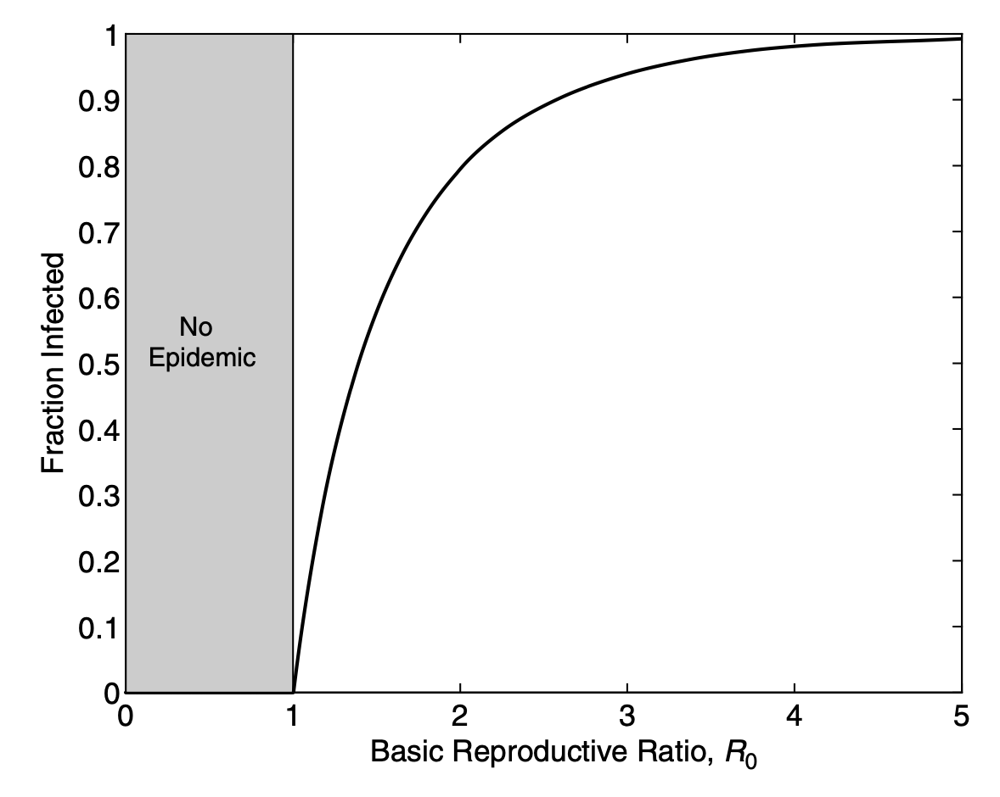

```{r, include=FALSE}
plot_folder <- file.path("plots", "reproductive-number/")
if (!dir.exists(plot_folder)) dir.create(plot_folder)

knitr::opts_chunk$set(message = FALSE, dpi = 400, fig.path = "plots/")

library(dplyr)
library(ggplot2)
```

layout: false

class: middle inverse

# Reproductive numbers

---

### Effective reproductive number

Whether an epidemic grows or shrink depends on the ratio between population **incidence rate** and **recovery rate**. The ratio of these two parameters is the **effective reproductive number $\mathcal{R}_t$**:

$$\mathcal{R}_t= \frac{\lambda S}{\gamma I} = \beta \frac{I}{N} \frac{1}{\gamma I} S = \frac{\beta}{\gamma} \frac{S}{N}$$

.blockquote[
The **effective reproductive number** describes the **trend of the epidemic at a given time**. It can also be interpreted as the number of susceptibles an infectious individual can infect before recovering.
]

--

If this number is above 1 the number of cases increases faster than they recover and we observe an exponential growth. $\mathcal{R}_t$ decreases in these situations:

- the **force of infection was decreased** (e.g. by public health interventions or change in behavior)
- the **fraction of susceptibles has decreased** (natural immunity or vaccination)
- **the recovery rate** was increased by a pharmacological/clinical solution.

---

### Basic reproductive number


If we consider the beginning of the epidemic when the population is fully susceptible and we insert one single infected case $(S = N - 1 \implies \frac{S}{N} \approx 1)$ we get the **basic reproductive number $\mathcal{R}_0$**:

$$\mathcal{R}_0=\frac{\beta}{\gamma} \frac{N-1}{N} \approx \frac{\beta}{\gamma}$$
--

.blockquote[
The **basic reproductive number** represents the **invasive potential** of a given pathogen in a specific, homogeneous population.
]

It can be interpreted as the number of susceptible an infectious individual can infect before recovering, in a totally susceptible population.

---

## Epidemic threshold (1)

The epidemic starts to decline when $\frac{dI}{dt}\le 0$, that is, infectious compartment starts to decrease. This can be rewritten as:

$$\frac{dI}{dt} \le 0 \implies$$
$$\implies \beta S \frac{I}{N} - \gamma I \le 0 \implies$$
$$\implies I(\beta \frac{S}{N} - \gamma) \le 0$$
--

That is the epidemic dies off if:
- $I = 0$, there are no infectious people anymore;
- $\beta \frac{S}{N} - \gamma \le 0$, the recovery rate is faster than the creation of new cases.

---

## Epidemic threshold (2)

In which situation does $\beta \frac{S}{N} - \gamma \le 0$?

$$\beta \frac{S}{N} - \gamma \le 0 \implies$$
$$ \implies \beta \frac{S}{N} \le \gamma \implies$$
$$ \implies \frac{S}{N} \le \frac{\gamma}{\beta}  \implies$$
$$ \implies \frac{S}{N} \le \frac{1}{\mathcal{R}_0}$$
--

.blockquote[
The **epidemic stops** or fail to start if the  **fraction of susceptibles is lower than** $\frac{1}{\mathcal{R}_0}$.
]

E.g., if ${\mathcal{R}_0}=2$, then $\frac{1}{\mathcal{R}_0}=0.5$, so the epidemic starts to decline when less than 50% of the population is susceptible.

---

## Herd immunity

.pull-left[
The epidemic threshold helps identifying public health targets.

.blockquote[
To stop the epidemic a population must reach a **level of immunity** such that:

$$\frac{R}{N} \ge 1 - \frac{1}{\mathcal{R}_0}$$
]

This can happen either by **natural immunity** or by **vaccination**.
(assuming no reinfection and sterilizing vaccines)
]

--

.pull-right[
**Herd immunity thresholds**

```{r Rzero, echo = FALSE}
R_zero <- tibble(
  P = c("Measles", "Chickenpox", "Mumps", "Rubella", "COVID-19 (Delta)", "Polio", "Pertussis", "Smallpox", "COVID-19 (Alpha)", "HIV", "COVID (initial)", "SARS", "Diphtheria", "Common cold", "Ebola", "Flu (pandemic)", "Flu (seasonal)", "MERS"),
  start = c(12, 10, 10, 6, 5, 5, 5.5, 3.5, 4, 2, 2.4, 2, 1.7, 2, 1.4, 1.3, 1.2, 0.3),
  stop = c(18, 12, 12, 7, 8, 7, 5.5, 6, 5, 5, 3.4, 4, 4.3, 3, 1.8, 2, 1.4, 0.8),
  startIm = 1 - 1 / start,
  stopIm = 1 - 1 / stop
)

tibble(R = seq(1, 20, length.out = 100), Im = 1 - 1 / R) %>%
  ggplot() +
  geom_line(aes(R, Im)) +
  geom_rect(data = R_zero %>% filter(P != "MERS"), mapping = aes(xmin = start, xmax = stop, ymin = startIm, ymax = stopIm, fill = reorder(glue::glue("{P} ({start} - {stop})"), start)), alpha = .5, color = "#262c40") +
  labs(x = expression(R[0]), y = "Required immunity", fill = NULL) +
  scale_y_continuous(breaks = seq(0, 1, .05), labels = function(x) paste0(round(x * 100), "%")) +
  theme_minimal()
```

]

---

## Final epidemic size

It can be demonstrated that total fraction of susceptible in time (here we take $S_f = \frac{S}{N}$ and $R_f = \frac{R}{N}$ for semplification) varies as:

$$S_{f(t)} = S_{f(0)}e^{-R_{f(t)}\mathcal{R}_0}$$
--

and that at the end of the epidemic the final number of affected (and recovered) will be:

$$R_{f(\infty)} = 1 - S_{f(0)}e^{-R_{f(\infty)}\mathcal{R}_0}$$
This function can only be solved numerically.

--

name: eq_state

.pull-left[

.blockquote[
- The epidemic **never hits 100%** of the population and the transmission breaks due to the **drop in infectious people** more than susceptible ones.
- The cumulative fraction of affected depends from the **initial conditions** $(S_{(0)})$ and from the **pathogen invasiveness** $(\mathcal{R}_0)$.
]
]

.pull-right.fig[

]
