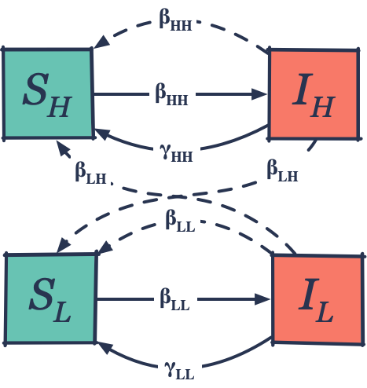
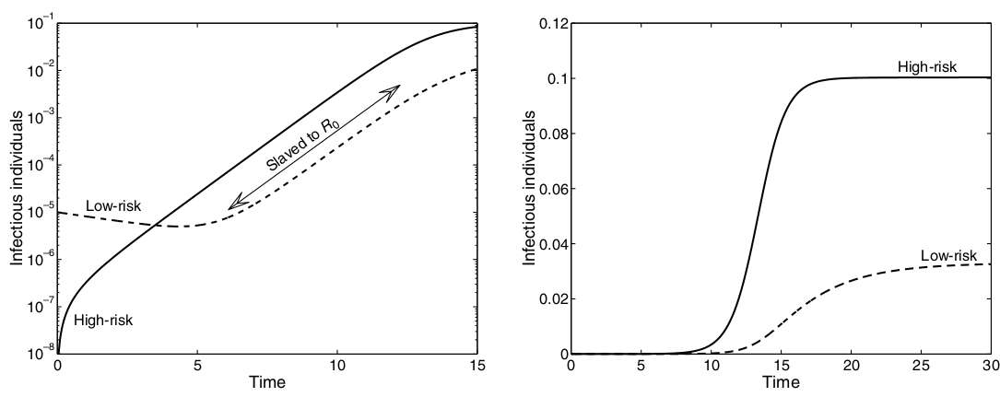
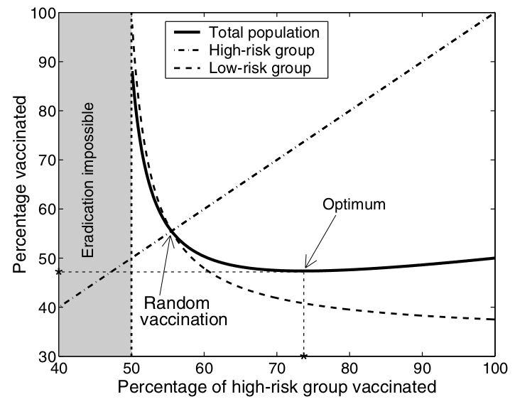
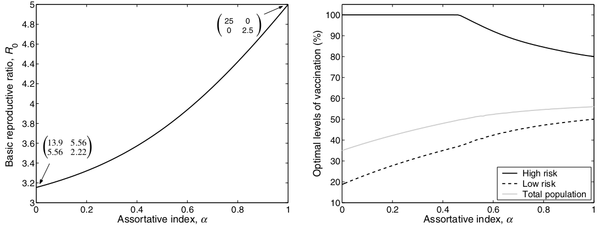
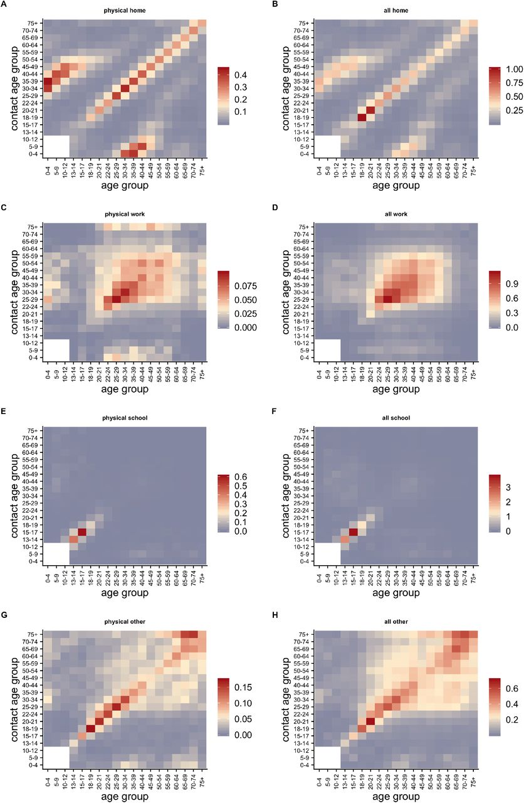

class: middle inverse

# Host heterogeneity and   transmission matrices

---

## Heterogeneity

Until now we assumed that:
- the transmission rate is equal for every individual;
- every individual can have a contact with everyone else in the population.

--

Including **heterogeneity** in the model relaxes the first assumption.

.center.fig50[]

---

## Heterogeneity sources

May sources of heterogeneity (and which parameter they change):

--

- Age $(\beta,\gamma)$

--
- Behavior $(\beta)$

--
- Living environment $(\beta)$

--
- Drugs $(\beta,\gamma)$

--
- Immunity status $(\beta,\gamma)$

--
- Other examples?

---

## Two-group SIS

A typical example are STD with no immunity. Let's assume a high risk group $H$ and a low risk group $L$, with $H \lt\lt L$, and no lifelong immunity (SIS model). Considering that $\frac{dS}{dt} = -\frac{dI}{dt}$ the model becomes:

--

.pull-left[
$$\frac{dI_H}{dt} = \beta_{HH} \frac{I_H}{N} S_H  + \beta_{HL} \frac{I_L}{N} S_H − \gamma I_H$$
$$\frac{dI_L}{dt} = \beta_{LH} \frac{I_H}{N} S_L + \beta_{LL} \frac{I_L}{N} S_L − \gamma I_L$$
$\beta$ can be described with a **transmission matrix**:

$$\pmb\beta = \begin{pmatrix}\beta_{HH} & \beta_{HL} \\ \beta_{LH} & \beta_{LL} \end{pmatrix}$$
.blockquote[
With $G$ risk groups, $\beta$ take the form of a $G \times G$ **Who Acquires Infection From Whom** matrix.
]
	
]

.pull-right[
.center.fig80[]
]

---

## Epidemic dynamics

In a two-groups SIS the epidemic has a **3-phases course**:
.blockquote[
- An **initial phase** determined by the group distribution.
- A **slaved phase** dominated by inter-infection between groups.
- An **equilibrium** phase.
]

.fig70.center[]

---

What about $\mathcal{R}_0$? There are actually **many of them**...

Given $n_H = 20\%$ and $n_L = 80\%$ the proportion of individuals in the two groups, the following (symmetric) $\pmb\beta$ matrix: $\pmb\beta = \begin{pmatrix}10 & 0.1 \\ 0.1 & 1 \end{pmatrix}$, and $\gamma = 1$ (for simplicity) we get initial, group specific $\mathcal{R}_0$:

$$\mathcal{R}_0^H = \frac{\beta_{HH} n_H + \beta_{LH} n_L }{\gamma} = 10 × 0.2 + 0.1 × 0.8 = 2.08$$
$$\mathcal{R}_0^L = \frac{\beta_{HL} n_H + \beta_{LL} n_L }{\gamma} = 0.1 × 0.2 + 1 × 0.8 = 0.82$$
--

And the general $\mathcal{R}_0$? it depends from the dynamic in the **slaved phase**. We require matrix algebra to compute $I_H^s/I^s,I_L^s/I^s$, i.e., the distribution of $I$ among groups in the slaved phase. In this case we have:

$$\mathcal{R}_0 = \mathcal{R}_0^H I_H^s/I^s + \mathcal{R}_0^L I_L^s/I^s \approx 2$$

--

.blockquote[
Each risk group drives an initial $\mathcal{R}_0$ which depends on the **group relative proportions** and **infectiousness**. The general $\mathcal{R}_0$ depends on the **infection proportion between groups in the slaved phase** and lies between the group $\mathcal{R}_0$.
]

---

## Epidemic equilibrium

In an **unstructured model**, we expect a proportion of susceptibles at equilibrium defined by $\frac{S_{(\infty)}}{N} = \frac{1}{\mathcal{R}_0}$, which for the previous example with $\mathcal{R}_0 = 2$ would imply a **50% of susceptible**.

But if one computes the **fraction of infectious at equilibrium** observes $\frac{I_{H(\infty)}}{N} = 0.1, \frac{I_{L(\infty)}}{N} = 0.033$ (**possible only by numerical solution**). Then the equilibrium proportion on susceptibles is $\frac{S_{(\infty)}}{N} = \frac{(N_H - I_{H(\infty)}) + (N_L - I_{L(\infty)})}{N} = 0.867$, **much higher than expected** for such an high $\mathcal{R}_0$.

The interpretation is:

.blockquote[
- The **small high risk group drives the high $\mathcal{R}_0$** but the larger **low risk group keep the equilibrium total prevalence lower than expected**.
- Even if the prevalence is low, the **small high risk group keeps the epidemic active** through **spillover effect** and makes it difficult to eradicate, as shown by the high $\mathcal{R}_0$.
]

---

## Epidemic control

The **herd immunity (HI) threshold** is $1 - \frac{1}{\mathcal{R}_0}$, like in the homogeneous model, **if vaccination happens at random** in the population but It gets lower if the **high risk group is targeted** during vaccinations.

The picture shows an epidemic with $\mathcal{R}_0 = 2.25, \frac{N_H}{N} = 0.2, \frac{N_L}{N} = 0.8$; HI can be reached either vaccinating 55% at random, or 75% in the $H$ group and 40% in the $L$ group, that is 47% of the population.

--

.pull-left[

]

--

.pull-right[
.blockquote[
- **Vaccinating $1 - \frac{1}{\mathcal{R}_0}$ at random** would help achieve herd immunity.
- A **targeted vaccination** of the **smaller high risk group** would achieve herd immunity while **vaccinating a lower overall proportion of population**. 
]
]

---

## Mixing patterns

Two groups can have different level of cross interaction. Take the following WAIFW matrices:

$$\pmb\beta_1 = \begin{pmatrix}10 & 2 \\ 2 & 3 \end{pmatrix}, \pmb\beta_2 = \begin{pmatrix}10 & 0 \\ 0 & 3 \end{pmatrix}$$
In $\pmb\beta_1$ there's mixing between groups, while in $\pmb\beta_2$ individuals interact only with other people in their group.

--

.pull-left[
The second is situation is said to have **high assortativity**, as measured by the index $\alpha$.

]
--

.pull-right[

A different degree of assortativity impacts the epidemic dynamics.

.blockquote[
- **High assortativity increases** $\mathcal{R}_0$ because infection events from the high risk group are **not "wasted"** on the low risk one.
- With high assortativity, it is **less relevant to have differential vaccination targets** by risk group since there's **no spillover effect**.
]
]

---

name: age_matrix

## Age contact patterns

.pull-left[
It's common to consider **age contact matrices** in infectious disease modeling.

People usual get **mostly in contact with peers** but, depending on age, some **alternative patterns** are more evident.
For example, small children have high contact rates with parents and gran parents.

If multiple settings are considered it's possible to observe even more diversity, with lower assortativity in work places or shops and specific adult-children patterns at school.

It's possible to build complex WAIFW matrices with hundreds of $\beta$ parameters. Alternative solution are more advanced models which use **continuous compartments**.
]

.pull-right.fig80.fig[

.ref[https://www.medrxiv.org/content/10.1101/2020.02.16.20023754v2.full]
]
