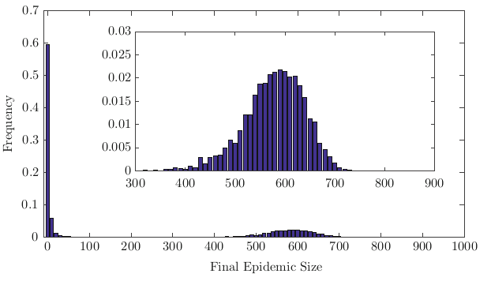

```{r, include=FALSE}
plot_folder <- file.path("plots", "stochastic-models/")
if (!dir.exists(plot_folder)) dir.create(plot_folder)

knitr::opts_chunk$set(message = FALSE, dpi = 400, fig.path = "plots/")

library(dplyr)
library(ggplot2)
```

class: middle inverse

# Stochastic Models

---

## General description

.pull-left[
Instead of focusing on rates, Stochastic models rely on **individual infection probability**.

The usual approach is to consider each infection as a **random yes/no event with a given probability**. Like a trick coin.

Such events are modeled as **Bernoulli random variables**:

$$P(Inf = 1|\pi) \sim \mathcal{Bernoulli}(\pi) $$

]

.pull-right[

]

---

## Epidemic dynamics

If stochasticity is considered, $\mathcal{R}_0$ by itself **cannot guarantee whether there will be an outbreak** with certainty.

Statistics like **cumulative number of infected**, **final susceptible fraction**, **peak prevalence**, etc cannot be predicted with certainty (one number), but will be described by **probabilistic distributions**.

--

.center[

]
---

## Random extinction

.pull-left[
The **likelihood of an epidemic outbreak** $E$ depends on the $\mathcal{R}_0$ and the **number of initial cases** $i_0$ (introductions):

$$P(E) = 1 - \frac{1}{(\mathcal{R}_0)^{i_0}}$$
.blockquote[
- Even with $\mathcal{R}_0 > 1$ **an epidemic may die off**.
- A **partially resistant population** decreases the chances of an epidemic, while **new introductions increase them**.
- Given the random risk of extinction, often a epidemic dies off **before reaching the herd immunity threshold** with vaccinations.
]

]

.pull-right[
```{r stochastic R0, echo = FALSE}
lapply(c(1.5, 2, 4, 8, 20), function(R) {
  tibble(I = 1:100, P = 1 - 1 / R^I, R)
}) %>%
  bind_rows() %>%
  ggplot(aes(I, P, color = factor(R))) +
  geom_line() +
  geom_point() +
  scale_x_continuous(trans = "log", labels = round) +
  scale_y_continuous(labels = scales::percent) +
  labs(x = "Initial introductions", y = "Pr. of epidemic", color = expression(R[0])) +
  theme_minimal()
```

]
