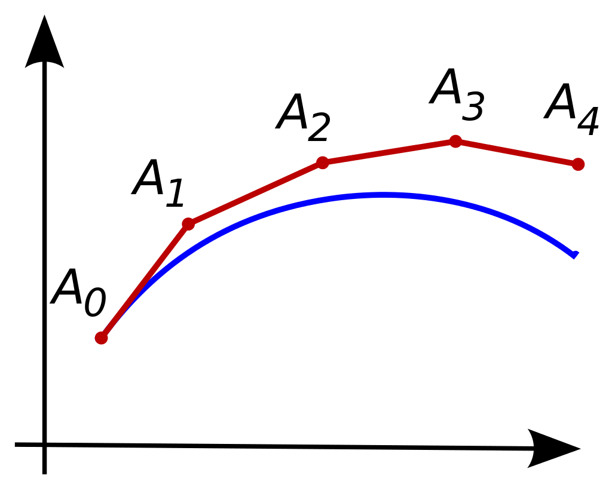

```{r, include=FALSE}
plot_folder <- file.path("plots", "model-simulation/")
if (!dir.exists(plot_folder)) dir.create(plot_folder)
	
knitr::opts_chunk$set(message = FALSE, dpi = 400, fig.path = plot_folder)

library(DiagrammeR)
requireNamespace("knitr")
```
class: middle inverse

# Compartmental model simulation

---

Differential equation systems cannot be solved analytically.

.blockquote[
- A numerical solution means solving the equation in **small consecutive steps** by simulating the epidemic.
- There are multiple algorithms, called **ODE solvers**.
]

--

.pull-left[
The simplest solver is the **Euler method**:
.font075[
- Choose a small time interval (e.g. one day).
- Choose initial values for compartments (e.g. $S_{t=0}=999$, $I_{t=0}=1$, $R_{t=0}=0$).
- Choose parameter values (e.g. $\beta$ and $\gamma$).
- Update the compartments at time $t$ using the state at time $t-1$ and the SIR equations:
]

.block[
$$S_t = -\beta I_{t-1}/N S_{t-1} + S_{t-1}$$
$$I_t=\beta I_{t-1}/N S_{t-1} -\gamma I_{t-1} + I_{t-1}$$
$$R_t=\gamma I_{t-1} + R_{t-1}$$

]
]

--

.pull-right[
This method is far from perfect... but there are better algorithms!
.fig90[]
]

---

## Setup

To solve SIR models we will use the [R programming language](https://www.r-project.org/) (I will assume basic knowledge of it).
We will need also the package `deSolve` which provide tools to solve differential equations numerically.

Let's start by setting up the workspace:

```{r init}
# install.packages(c("deSolve", "dplyr", "tidyr", "ggplot"))
library(deSolve) # for solving differential equations
library(dplyr) # to easily manipulate data
library(tidyr) # also to manipulate data
library(ggplot2) # for nice plots
```

We will solve a very simple SIR model with parameters $\beta = 1, \gamma = 1/8$.

.grViz[
```{r base_model, echo = FALSE}

add_mathjax(grViz(
  r"(
	digraph SIR {

	graph [overlap = true, fontsize = 10, margin=0]

	node [shape = box, fontname = Helvetica, style = filled]
	S [fillcolor = "#7EC1B3"]
	I [fillcolor = "#E8806F"]
	R [fillcolor = "#C373B6"]

	rankdir="TB";
	{ rank = same; S I R }

	S -> I [label = "$\\beta = 1$"]
	I -> R [label = "$\\gamma = 1/8$"]
	}
	)",
  height = 250, width = 500
))
```
]

---

## Model inputs

The first step to create a compartimental model is to define in R:

- the **initial conditions** of the model $S_0, I_0, R_0$, etc...;
- the **model parameters** $\beta, \gamma$, etc....
- the **time points** at which we are solving the model (a vector of days, years, minutes, etc...);

```{r init_cond}

# The state of the model at the beginning of the simulation
initial_conditions <- c(
  S = 10^6, # a population of 1 mln inhabitants
  I = 1, # initial infectious case introduced in the population
  R = 0 # the population is naive to the pathogen
)

parameters <- c(
  beta = 1, # one effective contact per day
  gamma = 1 / 8 # the disease last eight days
)

days <- 1:60 # a vector of days on which to solve the model
```

---

## Model code

Next we need to define a **function that represents the SIR model** to be passed to `deSolve:oda()`.

```{r}
sir_model <- function(time, state, parameters) {

  # tell R to look for variable names within the state and parameters objects
  with(as.list(c(state, parameters)), {

    # Calculating the total population size N
    # (the sum of the number of people in each compartment)
    N <- S + I + R

    # Defining lambda as a function of beta and I:
    lambda <- beta * I / N

    # The differential equations
    dS <- -lambda * S # the change in susceptible individuals
    dI <- lambda * S - gamma * I # the change in infectious individuals
    dR <- gamma * I # the change in immune individuals

    # Return the number of people in the S, I and R compartments at each
    # timestep (in the same order as the input state variables)
    return(list(c(dS, dI, dR)))
  })
}
```

---

## Running the model

Now we can run the simulation with `deSolve::ode` which uses as default the algorithm **LSODA** (*linear solver of ODE algorithm*).

```{r sim_run}

## The ouput is a matrix, but it's easier to work with data frames
simulation <- as.data.frame(deSolve::ode(
  y = initial_conditions, # the initial condition
  times = days, # the vector of times at which evaluating the model
  func = sir_model, # the function that describes the SIR model
  parms = parameters # the model parameters
))
```

`r knitr::kable(head(simulation))`

---

## Visualizing the results

And visualize the results using `ggplot2`.

```{r sim_plot_code, fig.show='hide', fig.height=5, fig.width=11}

# encapsulating the code into a function for reuse
plot_model <- function(sim) {

  # Transform a dataset from wide to long format
  tidyr::pivot_longer(
    data = sim, # the simulation data
    cols = -time, # we don't want to transform this variable
    names_to = "comps", # the new column in which to put the compartment name
    values_to = "value" # the new column in which to put the estimated value
  ) |> # pipe operator, you need R > 4.1 to use it or use |> defined in dplyr
    ggplot(aes(x = time, y = value, color = comps)) + # setup the plot
    geom_line() + # add a line for each compartment
    theme_minimal() + # prettier than the default theme
    labs(x = "days", y = "Pop.", color = "Compartments") # add some names
}

plot_model(simulation)
```

---

## Visualizing the results

And visualize the results using `ggplot2`.

.fig85[
```{r sim_plot, echo = FALSE}
knitr::include_graphics(file.path(plot_folder, "sim_plot_code-1.png"))
```
]

---

### The model with ${\mathcal{R}_0} \lt 1$

We now simulate an large imported outbreak (half of the population) but with parameters that produce an ${\mathcal{R}_0} \lt 1$.

```{r r0_lt1_code, fig.show='hide', fig.height=5, fig.width=11}
parameters <- c(
  beta = 1 / 8, # one effective contact every eight days
  gamma = 1 / 5 # the disease last five days
)

# Half of the population is infected
initial_conditions <- c(
  S = 5 * 10^5, # the population minus the introduced cases
  I = 5 * 10^5, # initial infectious cases introduced in the population
  R = 0
)

# `days` stays the same

simulation <- as.data.frame(deSolve::ode(
  y = initial_conditions, # the initial condition
  times = days, # the vector of times at which evaluating the model
  func = sir_model, # the function that describes the SIR model
  parms = parameters # the model parameters
))

plot_model(simulation)
```

---

### The model with ${\mathcal{R}_0} \lt 1$

We now simulate an large imported outbreak but with parameters that produce an ${\mathcal{R}_0} \lt 1$.

```{r r0_lt1, echo=FALSE, fig.height=5, fig.width=11}

knitr::include_graphics(file.path(plot_folder, "r0_lt1_code-1.png"))

```

---

## Herd immunity threshold

Let's see what happens when there's an epidemic with ${\mathcal{R}_0} \gt 1$ but with two different populations, one vaccinated at the level of the herd immunity threshold, and one 10% below.

```{r imm_thresh_code1}

parameters <- c(
  beta = 1, # one effective contact per day
  gamma = 1 / 8 # the disease last eight days
)

R0 <- as.vector(parameters["beta"] / parameters["gamma"]) # as.vector removes names
ImmThresh <- 1 - 1 / (R0) # the immunity threshold

# The state of the model at the beginning of the simulation
N <- 10^6 - 100000
initial_conditions_above <- c(
  S = N - N * ImmThresh, # the susceptible population
  I = 100000, # initial infectious cases introduced in the population
  R = ImmThresh * N # the population is partially vaccinated
)

initial_conditions_below <- c(
  S = N - N * ImmThresh * .9, # the susceptible population
  I = 1, # initial infectious case introduced in the population
  R = ImmThresh * N * .9 # the population is partially vaccinated
)
# -> next slide...
```

---

## Herd immunity threshold

```{r imm_thresh_code2, fig.show='hide', fig.height=4, fig.width=11}

days <- 1:200

# simulate the ODE twice, one for each set of initial conditions
sim_above <- as.data.frame(deSolve::ode(
  initial_conditions_above, days, sir_model,
  parameters
))
sim_below <- as.data.frame(deSolve::ode(
  initial_conditions_below, days, sir_model,
  parameters
))

# join the two simulations in one dataset with a label to differentiate the models
simulation <- bind_rows(
  sim_above |> mutate(model = "Vaxed pop above Immunity Threshold"),
  sim_below |> mutate(model = "Vaxed pop below Immunity Threshold")
)

tidyr::pivot_longer(
  simulation, # the simulation data
  -c(time, model), # new! we don't want to transform these variable
  names_to = "comps", # the new column in which to put the compartment name
  values_to = "value" # the new column in which to put the estimated value
) |>
  ggplot(aes(x = time, y = value, color = comps)) + # setup the plot
  geom_line() + # add a line for each compartment
  facet_wrap(~model) + # new! split the plot, one plot for each model
  theme_minimal() + # prettier than the default theme
  labs(x = "days", y = "Pop.", color = "Compartments")
```

---

## Herd immunity threshold

The ${\mathcal{R}_0}$ in the simulation was `r signif(R0, 2)`, while the immunity threshold was `r signif(ImmThresh * 100, 3)`%.


```{r imm_thresh_plot, echo = FALSE, fig.height=4, fig.width=11}

# knitr::include_graphics(file.path(plot_folder, "imm_thresh_code2-1.png"))

```

---

## Model with demographics

Let's see what happens with a open stable population with a birth/mortality rate of 1/80.

```{r demog_init}

# The state of the model at the beginning of the simulation
initial_conditions <- c(
  S = 10^4, # a population of 1 mln inhabitants
  I = 1, # initial infectious case introduced in the population
  R = 0 # the population is naive to the pathogen
)

parameters <- c(
  beta = 60, # 60 effective contacts per month
  gamma = 1 / (8 / 30), # the disease last eight days
  mu = 1 / (80 * 12) # monthly mortality/birth rate
)

days <- 1:1000 # a vector of months on which to solve the model

# -> next slide...
```

---

```{r demog_model}

sir_model <- function(time, state, parameters) {

  # tell R to look for variable names within the state and parameters objects
  with(as.list(c(state, parameters)), {

    # Calculating the total population size N
    # (the sum of the number of people in each compartment)
    N <- S + I + R

    # Defining lambda as a function of beta and I:
    lambda <- beta * I / N

    # The differential equations with the extra mu parameter
    dS <- N * mu - lambda * S - S * mu # the change in susceptible individuals
    dI <- lambda * S - gamma * I - I * mu # the change in infectious individuals
    dR <- gamma * I - R * mu # the change in immune individuals

    # Return the number of people in the S, I and R compartments at each
    # timestep (in the same order as the input state variables)
    return(list(c(dS, dI, dR)))
  })
}

# -> next slide...
```

---

```{r demog_run, fig.show='hide', fig.height=4, fig.width=11}
# run the model
simulation <- as.data.frame(deSolve::ode(
  y = initial_conditions, # the initial condition
  times = days, # the vector of times at which evaluating the model
  func = sir_model, # the function that describes the SIR model
  parms = parameters # the model parameters
)) |>
  mutate(time = time / 12) # transform months into years

# compute relevant statistics
R0 <- with(as.list(parameters), beta / (gamma))
R0demog <- with(as.list(parameters), beta / (gamma + mu))
AgeInf <- with(as.list(parameters), 1 / (mu * (R0demog - 1)))
Period <- with(as.list(parameters), 2 * pi * sqrt(AgeInf * (gamma + mu)))

AgeInf <- AgeInf / 12 # transform months into years
Period <- Period / 12 # transform months into years

# plot the simulation
plot_model(simulation) + # we need to modify the output a bit
  facet_wrap(~comps, scales = "free_y") + # split by comp. with different scales
  xlab("years") # override x axis title
```

---

The expected close population $\mathcal{R}_0$ is `r signif(R0, 5)`, very close to `r signif(R0demog, 5)` which considers demographics.

The **age of infection** is `r signif(AgeInf, 3)` years, and the **periodicity** of `r signif(Period, 3)` years.

```{r demog_plot, fig.height=4, fig.width=11, echo=FALSE}
# knitr::include_graphics(file.path(plot_folder, "demog_run-1.png"))
```
