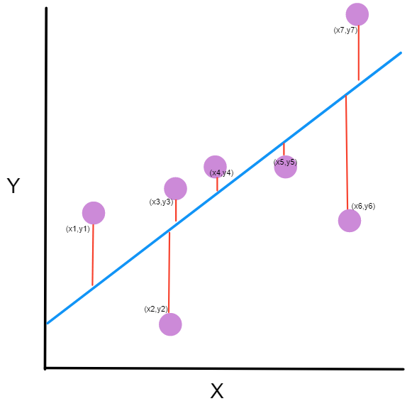

```{r, include=FALSE}
plot_folder <- file.path("plots", "param-estimation/")
if (!dir.exists(plot_folder)) dir.create(plot_folder)

knitr::opts_chunk$set(message = FALSE, dpi = 400, fig.path = "plots/")

library(deSolve) # for solving differential equations
library(dplyr) # to easily manipulate data
library(tidyr) # also to manipulate data
library(ggplot2) # for nice plots

requireNamespace("knitr")

plot_model <- function(sim) {

  # Transform a data set from wide to long format
  tidyr::pivot_longer(
    data = sim, # the simulation data
    cols = -time, # we don't want to transform this variable
    names_to = "comps", # the new column in which to put the compartment name
    values_to = "value" # the new column in which to put the estimated value
  ) |> # pipe operator, you need R > 4.1 to use it or use |> defined in dplyr
    ggplot(aes(x = time, y = value, color = comps)) + # setup the plot
    geom_line() + # add a line for each compartment
    theme_minimal() + # prettier than the default theme
    labs(x = "days", y = "Pop.", color = "Compartments") # add some names
}
```

class: middle inverse

# Parameter estimation

---

## General aspects

One we are presented with real outbreak data we can either use **parameters from the literature** and match the simulation with the data, or we can **use the data** to estimate the model parameters.

--

Usually it's common to estimate the **transmission parameters** (e.g., $\beta$) from the data and use the **infection specific parameters** (like $\gamma$) from literature, in order to help the **fit algorithm to converge**.

--

The steps to estimate an epidemic parameters:

- acquire case data (or other data, the more the better);
- choose a model that describe them;
- estimate the parameters;
- evaluate the parameters through simulation;
- take insights on the epidemics (e.g., ${\mathcal{R}_0}$, herd immunity threshold, prevalence prediction, intervention impact, etc...)

---

## General aspects

Parameters estimation is usually carried on through two techniques:

- **Mean Squared Error minimization**;
- **Likelihood maximization**.

---

## Mean Squared Error

We want to estimate the parameters that **minimize the error between the predictions and the data**, that is the **mean squared error (MSE)**.

--

.pull-left[
Formally, given a function of time and parameters $f(t, \boldsymbol{\theta})$ which produces simulated data, and the observed data $y_{t}$, we want to find the set of parameters so that:

$$\arg\min_\boldsymbol{\theta} \frac{1}{T}\sum_{t =t_0}^T(f(t, \boldsymbol{\theta}) - y_{t})^2$$
that is minimize the **mean of the squared differences** between the predicted and observed data.
]

.pull-right[

]

---

## Maximum Likelihood method

With the **Maximum Likelihood Estimation (MLE)** approach we want to find the set of parameters that **maximizes the probability of the data given the parameters**, that is, their **likelihood**.

--

.pull-left[
Formally a **likelihood function** $\mathcal{L}$ describes the probability of the data $D$ given a set of parameters $\boldsymbol{\theta}$:

$$\mathcal{L} = p(D|\theta) = \prod_{t =t_0}^T p(y_{t}|\boldsymbol{\theta})$$

considering as before $y_{t}$ the observed cases at each time $t$.

]

.pull-right.img-no-marg[

]

---

## Maximum Likelihood method

Since this value can become very small (a product of probabilities gets exponentially smaller), computers may have issues working with (so called **underflow problem**) so it's common to maximize the **log-likelihood**, which can be summed up between observations instead of multiplied.

$$\arg\max_\boldsymbol{\theta} \sum_{t =t_0}^T \text{log}(p(y_{t}|\boldsymbol{\theta}))$$

---

## Which Likelihood?

.pull-left[
The likelihood function depends on the problem and the data, for example:
- Continuous positive/negative values spanning from $-\infty$ to $+\infty$: **Normal Distribution**.
- Similar but limited to the $0+,+\infty$ range: **Log-normal Distribution**.
- Successes over a number of trials: **Binomial Distribution**.
- Count of random events with similar rates: **Poisson Distribution**.
- Count of random events with variable rates: **Negative-Binomial Distribution**.
- Homogeneous waiting times: **Exponential Distribution**.
]

.pull-right[
.blockquote[
- SIR model events are well described by either **Poisson** (unbound number of cases, open or unknown population) or **Binomial** (number of events in a known fixed population).
- The Poisson model gets **more biased** as the number of infected get **closer to the total population**.
]
]

---

### MSE vs Likelihood

.pull-left[
### MSE

- .green[√] easy to compute manually (not a problem now-a-days);
- .green[√] easy to interpret;
- .blue[=] similar to normal distribution likelihoods;
- .red[!] quite biased for low number of cases (e.g. the initial and final phases of epidemics);
- .red[!] may produce impossible results since "negative cases" are fine.
]

.pull-right[
### MLE

- .green[√] flexible to many kind of data;
- .green[√] respect data nature, so it works well for all phases of the epidemics;
- .green[√] allows to consider various data sources at once with the same likelihood score;
- .blue[=] using a normal distribution equates to using MSE;
- .red[!] cannot be easily computed manually, so you trust the algorithms;
- .red[!] needs domain expertise to choose the right likelihood function.
- .red[!] needs more data.
]

---

## Setup

Again we will use [R programming language](https://www.r-project.org/). Also I will assume that you already followed the lesson on model simulation.

Let's load the required packages.

```{r init}
# install.packages(c("deSolve", "dplyr", "tidyr", "ggplot"))
library(deSolve) # for solving differential equations
library(dplyr) # to easily manipulate data
library(tidyr) # also to manipulate data
library(ggplot2) # for nice plots
```

---

## Model simulation

In order to verify that our algorithm works, we will first simulate an epidemic and then extract the data from it. We will use a basic SIR model with the following initial conditions:

```{r init_cond}

# The state of the model at the beginning of the simulation
initial_conditions <- c(
  S = 10^6, # a population of 1 mln inhabitants
  I = 1, # initial infectious case introduced in the population
  R = 0 # the population is naive to the pathogen
)

parameters <- c(
  beta = 1, # one effective contact per day
  gamma = 1 / 8 # the disease last eight days -> gamma = 0.125
)

days <- 1:60 # a vector of days on which to solve the model
```

---

Then we use a usual SIR model:

```{r sir_model}
sir_model <- function(time, state, parameters) {

  # tell R to look for variable names within the state and parameters objects
  with(as.list(c(state, parameters)), {

    # Calculating the total population size N
    # (the sum of the number of people in each compartment)
    N <- S + I + R

    # Defining lambda as a function of beta and I:
    lambda <- beta * I / N

    # The differential equations
    dS <- -lambda * S # the change in susceptible individuals
    dI <- lambda * S - gamma * I # the change in infectious individuals
    dR <- gamma * I # the change in immune individuals

    # Return the number of people in the S, I and R compartments at each
    # time step (in the same order as the input state variables)
    return(list(c(dS, dI, dR)))
  })
}
```

---

... and simulate the data:


```{r model_sim}
simulation <- as.data.frame(deSolve::ode(
  y = initial_conditions, # the initial condition
  times = days, # the vector of times at which evaluating the model
  func = sir_model, # the function that describes the SIR model
  parms = parameters # the model parameters
))
```

which produces the following output (using `plot_model()` defined in the model simulation lesson):

```{r model_plot, fig.height=3, fig.width=11, echo = FALSE}
plot_model(simulation)
```

---

### Data simulation

For each day in the simulation we extract the number of cases. also we add some **random noise which scales with the prevalence**.

Since the **number of events is integer**, but the **simulated values are continuous** (mass effect), we need to transform them into integers. The simplest approach is just to `round()` them; a slightly more correct way is to consider them as **mean rate** of a **Poisson process**, which also add extra uncertainty.

In order to better compare the two methods, we estimate the parameters on a **subset of the data** to then evaluate predictions on the whole data set (**out-of-sample** error). This also allow to avoid **overfitting** the data.

---

```{r simulate_data,  fig.height=3, fig.width=11}

set.seed(27827) # to get reproducible results

cases <- simulation$I + # the expected number of infected
  # random proportional normal noise around the rate
  rnorm(nrow(simulation), 0, simulation$I / 20)

# use a Poisson process to simulate the number of cases
cases <- rpois(nrow(simulation), cases)

sim_data <- data.frame(time = days, cases) |>
  # subset the simulated data to evaluate out-of-sample performance
  filter(time >= 10 & time <= 30)

plot_model(simulation |> select(time, I)) + # plot the simulated prevalence
  # add the generated random cases
  geom_point(data = sim_data, aes(x = time, y = cases, color = "simulated"))
```

---

### Parameter estimation

To minimize/maximize a **objective/target function**, in **R** it's common to use `optim()`, included in the base installation.

.pull-left[
.blockquote[
Optimization algorithms explore the **parameter space**, in order to **find its minimum/maximum** according to a function of interest (e.g., MSE or ML).
]
]

.pull-right[

.ref[https://blog.paperspace.com/intro-to-optimization-in-deep-learning-gradient-descent/]
]

---

### Parameter estimation setup

In order to find parameters we need to define a **objective/target function** to optimize.

In our case, the objective function:

- takes the model parameters suggested by `optim()`;
- simulate an outbreak with `deSolve::ode()` using the parameters;
- compare the results to the data using MSE or ML.

According to the comparison result `optim()` will **choose new combination of parameters** to test. To start the algorithm we also need to choose some **initial values** for the parameters, that we expect to be close to the real ones.

```{r init_vals}
init_vals <- c(beta = 1, gamma = 1)
```

---

### MSE optimization

Let's now optimize the parameters using the MSE approach:

```{r MSE_code}
obj_fun <- function(parms, data) {
  # Calculate model output
  traj <- as.data.frame(deSolve::ode(
    # some arguments are taken from the global space:
    y = initial_conditions, func = sir_model, times = days,
    # parms is generated by optim()
    parms = parms
  ))

  # retain only simulated cases for which we have data
  pred_cases <- traj$I[traj$time %in% data$time]

  # Calculate sum of squared errors of the model fit,
  # taking the mean is not necessary since N is always the same
  SSE <- sum((pred_cases - data$cases)^2)

  return(SSE)
}

# -> next slide...
```

---

### MSE optimization

```{r MSE_optim}

outMSE <- optim(
  par = c(beta = 1, gamma = 1), # initial values for the parameters
  fn = obj_fun, # the function to minimize
  data = sim_data # extra custom parameters to pass to fn
)

outMSE
```

---

### MLE optimization

We will use now the MLE optimization.

```{r MLE_code}
obj_fun <- function(parms, data) {
  # Calculate model output
  traj <- as.data.frame(deSolve::ode(
    # some arguments are taken from the global space:
    y = initial_conditions, func = sir_model, times = days,
    # parms is generated by optim()
    parms = parms
  ))

  # retain only simulated cases for which we have data
  pred_cases <- traj$I[traj$time %in% data$time]

  # Calculate Poisson likelihood. Notice log = TRUE to allow using a sum of
  # log-likelihood values instead of the product of likelihoods
  LL <- sum(dpois(x = data$cases, lambda = pred_cases, log = TRUE))

  return(-LL) # we take the negative since optim() performs minimization
}

# -> next slide...
```

---

### MLE optimization

```{r MLE_optim}

outMLE <- optim(
  par = c(beta = 1, gamma = 1), # initial values for the parameters
  fn = obj_fun, # the function to minimize
  data = sim_data # extra custom parameters to pass to fn
)

outMLE
```

---

## Fit evaluation

Estimated parameters should be tested against the observed data to get their **goodness of fit**. Even better, they should be compared with new data not used in the estimation.

```{r fit_evaluation_code}
simMSE <- as.data.frame(deSolve::ode(
  y = initial_conditions,
  times = days,
  func = sir_model,
  parms = outMSE$par # parameters fitted by MSE
))

simMLE <- as.data.frame(deSolve::ode(
  y = initial_conditions,
  times = days,
  func = sir_model,
  parms = outMLE$par # parameters fitted by MLE
))

# join the two simulations
eval_data <- bind_rows(
  data.frame(source = "MSE", days = days, cases = simMSE$I),
  data.frame(source = "MLE", days = days, cases = simMLE$I)
)

# -> next slide...
```

---

## Fit evaluation

```{r fit_evaluation_plot, fig.height=3, fig.width=11}
# plot them using as background the original simulated epidemic ("model")
# overshadowed by the epidemics generated by the estimated parameters,
# and the simulated random data
ggplot(eval_data, aes(x = days, y = cases, color = source)) +
  geom_line(data = simulation, aes(x = time, y = I, color = "model")) +
  geom_line(alpha = .5, size = 2) +
  geom_point(data = sim_data, aes(x = time, y = cases, color = "sim data")) +
  facet_wrap(~source) +
  theme_minimal()
```

