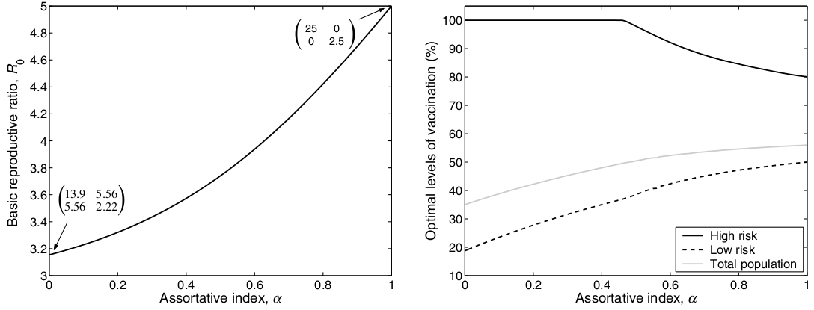
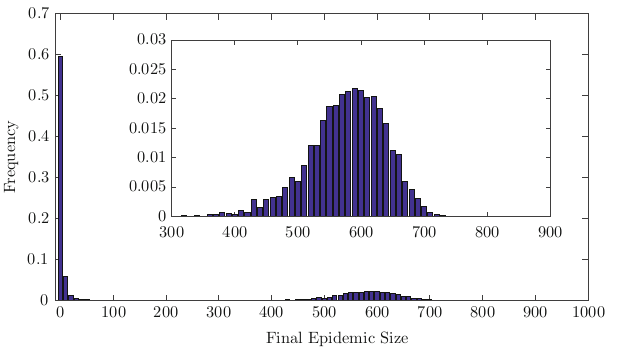

```{r, include=FALSE}

knitr::opts_chunk$set(message = FALSE, dpi = 400)

library(dplyr)
library(ggplot2)
```

class: split-50 title-slide

.row.body[
	.split-75[
		.column[.content[
				<h2>Introduction to</h2>
				<h1>Infectious<br>Disease Modeling</h1>
				<h3>Angelo D'Ambrosio</h3>
				<h5>Institute for Infection Prevention and Hospital Hygiene<br>Freiburg University Hospital, Freiburg, Germany</h5>
				<br>
				<h5>a.dambrosioMD@gmail.com, angelo</h5>
				]]
		.column.img-fill[
			
		]
	]
]
.row.img-fill.banner[
	
]

---

class: middle

## Outline

- Overview of SIR models and few extensions.
- Show how to get epidemiological insights from mathematical models.
- Some practical examples using R.

---

## Resources

.block[
.pull-left[

]
.pull-right[

]
]

https://rpubs.com/choisy/sir

---

class: middle inverse

# What does it mean to model

### and why it is important...

---
class: split-two, middle

.column[.content[

## Models are "useful" simplification of reality

Why useful?
- understand phenomena
- decompose their components
- make predictions

Quantitative models (mathematical/statistical) have the advantage to allow
**numerical predictions** that can be verified and fitted with **real data**.

.blockquote[**Models are as good as the prediction they make**]
]]

.column.img-contain[

]

---

.pull-left[

 ## Two approaches

  ### Top-down
  Start from the data and build a model that fit them well.
  
  Easier to build, rely more on statistical/data science skill than domain knowledge.
  
  May not generalize well outside observed data and may have not a natural interpretation.
  
  Examples: hypothesis testing, regression modeling, machine learning.
]

.pull-right[
  
<span style="float: right">©xkcd<span>
]

---

.pull-left[

 ## Two approaches

  ### bottom-up
  Build a model according to a theory and check it against the data.
  Data can also be used to fit the model parameters.
  
  Harder to build in a meaningful way, require both mathematical skill and domain knowledge.
  
  If well built can generalize well and the paramters usually have a natural interpretation.
  But nature is hardly so simple and well behaved (we will talk about this)
  
  Examples: weather forecast, physics models, infectious disease modeling.
]

.pull-right[

.copyright[xkcd]
]

???

not a hard separation

---

class: middle inverse

# Modeling infectious diseases

---

layout: true

.pull-left[

 ## Why infectious diseases?
 
 Growing public health problem.

 Complex behavior in time, hard to model and predict with top-down approaches.
 
 Mostly mono-factorial etiology (the pathogen) and a limited number of actors.
 This makes easier to develop solution, if the models are appropriate.
 
 A lot of hidden complexity.
]


---

.pull-right[

.copyright[RUSLAN NESTERENKO]
]


---

count: false

.pull-right[

.copyright[RUSLAN NESTERENKO]
]

---

layout: false
name: models_types
class: split-20

.row[
## Common models
]

.row[
.split-four[
  .column.center[
  
##### Agent-based model
.content[
Each agent is modeled individually, and interact between themselves and the environment
following specific rules. The interactions can change their disease status.

Very flexible, easier to model but computationally intensive (good for small scale simulations). Analytical solutions usually not available.
]

  ]
  .column.center[
  
##### Network model
.content[
Also in these models individual agents and their properties are modeled,
but there's no environment and the focus is on the
connections (fixed or dynamic) that allows infection events.

Less flexible, allow more mathematical abstraction; analytical solutions
for simple models but usually simulation analysis are needed.
]

  ]
  .column.center[
  
    
##### Compartimental model
.content[
The population is grouped into homogeneous "compartments" and the average dynamics
with which these compartments exchange individuals are modeled.

Much less flexible, higher mathematical abstraction needed to compensate flexibility;
many more assumptions (can be relaxed); computationally less demanding.
]

  ]
  .column.center[
  
##### Metapopulation model
.content[
A mixed model. Population is grouped into clusters (e.g., cities, countries) in which different epidemic dynamics can be modeled. The cluster exchange individuals (e.g. travels)

Can be modeled as a mix of abstraction and simulations.
]

  ]
]]

---

class: middle inverse

# Compartimental Models

---
layout: true
name: comp-models
class: split-two

.column[**Many alternative fomulations**
.content[


]
]

---

name: comp-models

.column[

### Susceptible-Infectious models
.blockquote[First proposed by Kermack & McKendrick (1927), they are the foundation for modeling infectious diseases.]

Describes an epidemic in term of the disease status (compartments) of fraction of the population,
for example Susceptible $(S)$, Infectious $(I)$, Recovered $(R)$. 

The individuals passes from between compartments according to specific rates.

]

???

Examples for each model and other variations

---

count: false
name: comp-models

.column[

### Susceptible-Infectious models
.blockquote[First proposed by Kermack & McKendrick (1927), they are the foundation for modeling infectious diseases.]

Describes an epidemic in term of the disease status (compartments) of fraction of the population,
for example Susceptible $(S)$, Infectious $(I)$, Recovered $(R)$. 

The individuals passes from between compartments according to specific rates.

Based on the assumption of:
- **Homogeneous Mixing**: Everyone is potentially in contact with everyone else in
the population with a given rate.
- **Mass Action**: The population size is not relevant, only the proportional
partition in compartments -> works well only for large populations.
]

???

Examples for each model and other variations

---

name: comp-models

.column[

### Susceptible-Infectious models
Mathematically are solved through **ordinary differential equations**.

There several modeling choices.

According to time definition:
- **Continouos-time models**: time is considered as a continouos flow.
- **Discrete-time models**: time is considered as a sequence of events of a given
duration.

According to the transmission mechanics:
- **Deterministic**: no random effects, paramters are fixed and equal for everyone
in the population. Given the same starting conditions, the epidemic trajectory is fixed.
- **Stochastic**: there is random variation at the individual level and/or at parameter level. Infectious event are discrete and random 

]

---

layout: false

class: middle inverse

# General SIR model

---

$$\frac{dS}{dt}=-\beta SI$$
$$\frac{dI}{dt}=\beta SI-\gamma I$$
$$\frac{dR}{dt}=\gamma I$$
The SIR models is a system of differential equations that defines the change in time $(dt)$ of the population in the compartments $S,I,R$ according to rates $\beta, \gamma$.

--

The progression from $S$ to $I$ depends on: prevalence of infected, the underlying population contact structure, and the probability of transmission given contact. These factors are described by the parameter $\beta$: the rate of a **successful infectious contact**.

--

The progression from $I$ to $R$ is parameterized by $\gamma$ and describes the **rate of recovery** from the infection.

--

.blockquote[
The parameters $\beta, \gamma$ are considered **fixed** and **equal on average** for the whole population (Deterministic Model).
]

---

### Differential equations

.pull-left[]

.pull-right[
A **function** $y=f(x, ...)$ describes the value of $y$ (dependent variable, output) for various values of on or many $x$ (indepentent variables, predictors, arguments, inputs). E.g. the position $y$ of a car after a certain time $x$.

The **derivative** $\frac{dy}{dx}$ describe how $y$ is changing when $x$ has a certain value. E.g. the velocity of the car at time $x$.

This change may not be fixed, but a function of the input and/or output $\frac{dy}{dx} = g(x,y,...)$ themselves. This is a **differential equation**. E.g. velocity changes on mountain roads, slopes, traffic jams, etc...

A group of interconnected equation is called a **system of differential equations**, like the SIR model.
]

---

### Differential equations

.pull-left[
Differential equations are used to describe **dynamical systems**, that is systems
that evolve in **time**.

**Solving** a dynamical systems means find the **state of the system at a given time**.
These systems can be solved in two ways:
- **Analytical solution**: also called close-form, there is a set of mathematical
operations that given a time $t$, allows you to get the status of the system $\mathcal{S}_t$ at that time.
This is possible only for very simple systems. E.g., how distant would get a car going at constant velocity or a velocity simply known at every point.
- **Numerical solution**: the only way to know $\mathcal{S}_t$ is to simulate the system time step by time step $\mathcal{S}_t = f(\mathcal{S}_{t-1})$. Usually the only way to solve complex or chaotic systems.
]

.pull-right.fig[]

---

### Let's go back to the SIR model

$\frac{dS}{dt}=-\beta SI$; $\frac{dI}{dt}=\beta SI-\gamma I$; $\frac{dR}{dt}=\gamma I$

To simplify calculation we assume a fixed population of size $N$, and $S,I,R$ as **fractions of this population**, not number of individuals.

--

$\beta SI$: The **rate of infection** of individuals at risk. It depends from how many risk contact an average person has $(\beta)$, adjusted by the ratio of infectious individuals among these contacts $(I)$, and by the rate of susceptible individuals $(S)$ still available.

--

$\gamma I$: the **recovery rate** at the population level. It determines how fast the proportion of infected in the population drops due to people recovering.

--

.center[]

---

### What is actually $\beta$?

A way to define it is the product of the (average) **number of contacts** $\kappa$ by the **probability of a efficacious contact** $\pi$ i.e. $\beta = \pi \kappa$. Actually this is a simplification of $\beta = -\kappa \text{log}(1 - \pi)$ given that $\text{log}(1 - \pi) ≈ -\pi$ se $\pi$ is close to zero. But where does this come from?

--

Consider $p$ as the probability of **YOU getting infected** by an infectious individual and rethink $\pi$ as the probability that **SOMEONE infects you**. $p$ and $\pi$ are equivalent when considering just a one-by-one contact. 

--

But what about the probability of getting infected by many individuals? First, consider that the probability of NOT getting infected is $1 - p = (1-\pi)$. Then, if there are $k$ at risk contacts this probability becomes (with few assumptions):

$$1-p=\prod_{i=1}^k(1-\pi_i) ≈ (1-\pi)^k$$
(the probability of "independent" events it's their probabilities' product).

---

### What is actually $\beta$?

If not all contact are infectious we can write the former as:

$$1-p = (1-\pi)^{kI}$$
with $I$ being the fraction of infected in the population.

--

Therefore the individual risk of infection bcomes:

$$p = 1 - (1-\pi)^{kI}$$
---

### What is actually $\beta$?

.pull-left[
What does $p = 1 - (1-\pi)^{kI}$ tell us? The probability of getting infected every given time is related to:
- the number of infectious contact $kI$;
- the probability of infection given contact $\pi$;

]

.pull-right[

```{r risk plot, echo = FALSE}
lapply(c(1,2,5,10,100), function(k) {
    tibble(p = seq(0,1, length.out = 100), k, q = 1 - (1-p)^k)
}) %>% bind_rows() %>%
    ggplot(aes(p, q, color = reorder(paste("kI =", k), k))) +
    geom_line() +
    theme_minimal() +
    labs(x = expression(pi), y = 'infection risk', color= 'infectious contacts')
```

]

---

### What is actually $\beta$?

.pull-left[
What does $p = 1 - (1-\pi)^{kI}$ tell us? The probability of getting infected every given time is related to:
- the number of infectious contact $kI$;
- the probability of infection given contact $\pi$;

.blockquote[Epidemics can be controlled either by **reducing the number of contacts** (e.g. social distancing, closures, lockdowns) or by **decreasing the risk of contagion** given a contact (masks, hand hygiene, physical distancing).]
]

.pull-right[

```{r risk plot 2, echo = FALSE}
lapply(c(1,2,5,10,100), function(k) {
    tibble(p = seq(0,1, length.out = 100), k, q = 1 - (1-p)^k)
}) %>% bind_rows() %>%
    ggplot(aes(p, q, color = reorder(paste("kI =", k), k))) +
    geom_line() +
    theme_minimal() +
    labs(x = expression(pi), y = 'infection risk', color= 'infectious contacts')
```

]

---

### What is actually $\beta$?

Defining $\beta = -\kappa \text{log}(1 - \pi)$ we can rewrite the risk formula $p = 1 - (1-\pi)^{kI}$ as:

$$p = 1 - e^{-\beta I}$$
--

taking the derivative in time (ie. the change of risk in time) we get the **force of infection** $\lambda$:

$$\frac{dp}{dt}=\beta I= \lambda$$
--

.blockquote[The **force of infection** represents the transmission rate per individual.]

When multiplied by the fraction of still susceptible individuals $\lambda S$ gives the growth of the cumulative number of cases in the epidemic.


---

### What is actually $\gamma$?

.blockquote[It represent the recovery rate of infected individuals.]

It derives from the average length of the infectious period which is $\frac{1}{\gamma}$. This latter value can be collected by clinical data or serology studies.

$\gamma$ increases if patients are treated with a pharmacological/clinical solution that either remove the pathogen or makes it non infectious.

---

### Reproductive numbers

We can consider $\lambda S$ as how fast the epidemic grows and $\gamma I$ how fast it dies out. The ratio of these two parameters is the **effective reproductive number $\mathcal{R}_t$**:

$$\mathcal{R}_t= \frac{\lambda S}{\gamma I} = \frac{\beta SI}{\gamma I} = \frac{\beta S}{\gamma}$$
.blockquote[The **effective reproductive number** describes the **trend of the epidemic**. It can be interpreted as the number of susceptible an infectious individual can infect before recovering.]

--

If this number is above 1 the number of cases increases faster than they recover and we observe an exponential growth. $\mathcal{R}_t$ in these situations:

- the **force of infection was decreased** (e.g. by public health interventions or change in behavior)
- the **fraction of susceptibles has decreased** (natural immunity or vaccination)
- **the recovery rate** was increased by a pharmacological/clinical solution.

---

### Reproductive numbers


If we consider the beginning of the epidemic when all the population is susceptible (S ≈ 1) and we insert one single infected case we get the **basic reproductive number $\mathcal{R}_0$**:

$$\mathcal{R}_0=\frac{\beta}{\gamma}$$
--

.blockquote[The **basic reproductive number** represents the **invasive potential** of a given pathogen in given, homogeneous population.]

It can be interpreted as the number of susceptible an infectious individual can infect before recovering, in a totally susceptible population.

---

## Epidemic Threshold (1)

The epidemic starts to decline when $\frac{dI}{dt}\le 0$, that is, infected people start to decrease. This can be rewritten as:

$$\frac{dI}{dt} \le 0 \implies$$
$$\beta S I - \gamma I \le 0 \implies$$
$$\implies I(\beta S - \gamma) \le 0$$
--

That is the epidemic dies off if:
- $I = 0$, there are no infectious people anymore;
- $\beta S - \gamma \le 0$, the recovery rate is faster than the creation of new cases.

---

## Epidemic Threshold (2)

For which value of $S$ does $\beta S - \gamma \le 0$?

$$\beta S - \gamma \le 0  \implies$$
$$ \implies \beta S \le  \gamma  \implies$$
$$ \implies S \le  \frac{\gamma}{\beta}  \implies$$
$$ \implies S \le  \frac{1}{\mathcal{R}_0}$$
--

.blockquote[
The epidemic stops if the fraction of susceptible is lower than $\frac{1}{\mathcal{R}_0}$ 
]

---

## Immunity

.pull-left[
The epidemic threshold helps dictating public health targets.

.blockquote[To stop the epidemic a population must reach a **level of immunity** equal to:

$$1 - \frac{1}{\mathcal{R}_0}$$
]

This can happen either by **natural immunity** or by **vaccination**, assuming no reinfection and sterilizing vaccines.
]

.pull-right[
```{r Rzero, echo = FALSE}
R_zero <- tibble(
    P = c("Measles", 'Chickenpox', 'Mumps', 'Rubella', 'COVID-19 (Delta)', 'Polio', 'Pertussis', 'Smallpox', 'COVID-19 (Alpha)', 'HIV', 'COVID (initial)', 'SARS', 'Diphtheria', 'Common cold', 'Ebola', 'Flu (pandemic)', 'Flu (seasona)', 'MERS'),
    start = c(12, 10, 10, 6, 5, 5, 5.5, 3.5, 4, 2, 2.4, 2, 1.7, 2, 1.4, 1.3, 1.2, 0.3),
    stop = c(18, 12, 12, 7, 8, 7, 5.5, 6, 5, 5, 3.4, 4, 4.3, 3, 1.8, 2, 1.4, 0.8),
    startIm = 1 - 1/start,
    stopIm = 1 - 1/stop
) 

tibble(R = seq(1,20, length.out = 100), Im = 1 - 1/R) %>%
    ggplot() +
    geom_line(aes(R, Im)) +
    geom_rect(data = R_zero %>% filter(P != 'MERS'), mapping = aes(xmin = start, xmax = stop, ymin = startIm, ymax = stopIm, fill = reorder(glue::glue('{P} ({start} - {stop})'), start)), alpha = .5, color = '#262c40') +
labs(x = expression(R[0]), y = 'Required immunity', fill = NULL) +
    scale_y_continuous(breaks = seq(0, 1, .05), labels = function(x) paste0(round(x * 100), '%')) +
    theme_minimal()
```

]

---

## Final epidemic size

It can be demonstrated that total fraction of susceptible in time varies as:

$$S_{(t)} = S_{(0)}e^{-R_{(t)}\mathcal{R}_0}$$
--

and that at the end of the epidemic the final number of affected (and recovered) will be:

$$R_{(\infty)} = 1 - S_{(0)}e^{-R_{(\infty)}\mathcal{R}_0}$$
This function can only be solved numerically.

--

name: eq_state

.pull-left[

.blockquote[
- The epidemic **never hits 100%** of the population and the transmission breaks due to the **drop in infectious people** more than susceptible ones.
- The cumulative fraction of affected depends from the **initial conditions** $(S_{(0)})$ and from the **pathogen invasiviness** $(\mathcal{R}_0)$.
]
]

.pull-right.fig[

]

---

class: middle inverse

# Model with demographics

---

## Demographics (1)

The model can be extended including the population birth and death rates $\nu, \mu$.
This is a so called **open population**.

$$\frac{dS}{dt}=\nu -\beta SI -\mu S$$
$$\frac{dI}{dt}=\beta SI-\gamma I - \mu I$$
$$\frac{dR}{dt}=\gamma I - \mu R$$
--

In this formulation, the $I$ compartment loses people not only for the recovery
rate but also for the natural mortality.

The basic reproduction number becomes:
$$\mathcal{R}_0 = \frac{\beta}{\gamma + \mu}$$

---

## Demographics (2)


In presence of birth and deaths, if the population is stable (i.e. $\nu = \mu$)
the epidemic either dies off $(\mathcal{R}_0 < 1)$ or it reaches an **equilibrium state** $(\mathcal{R}_0 > 1)$, characterized by:

$$(S^*, I^*, R^*) = \Big(\frac{1}{\mathcal{R}_0},\frac{\mu}{\beta}(\mathcal{R}_0 - 1), 1 - \frac{1}{\mathcal{R}_0} - \frac{\mu}{\beta}(\mathcal{R}_0 - 1)\Big)$$
--

.pull-left[

When demographics are considered end disease-related mortality is ignored, at the equilibrium $\mathcal{R}_0$ can be used to estimate the **mean age of infection**:

$$A \approx \frac{1}{\mu(\mathcal{R}_0 - 1)}$$
Consequently, the age of first infection and the life expectancy $L = \frac{1}{\mu}$
allow to estimate $\mathcal{R}_0$ at equilibrium:

$$\mathcal{R}_0 = \frac{L}{A}$$

]

.pull-right[

]

---

## Demographics (3)

The epidemic reaches the equilibrium through **oscillations**, whose period is:

$$T=2\pi\sqrt{AD}$$
with $A$ being the mean age of infection and $D=\frac{1}{\gamma + \mu}$ the average length of the infection period.

--

name: demog_3

.pull-left[
Regime for $\frac{1}{\mu} = 70$ years, $\beta = 520$ per year, and $\frac{1}{\gamma} = 7$ days, giving $\mathcal{R}_0 = 10$. Initial conditions were $S_{(0)} = 0.1$ and $I_{(0)} = 2.5 \times 10^{-4}$.
]

.pull-right[
.center[]
]

---

name: demog_sum

## Demographics (summary)

.blockquote[The basic reproductive number is **lower when considering demographics**
due to the **natural death of infected individuals**.]
<br>
.blockquote[
In presence of demographics the epidemic **reaches an equilibrium** through an **oscillatory dynamic** of the infection prevalence.
]
<br>
.blockquote[
The age of first encounter with the disease **decreases with $\mathcal{R}_0$**.
]
<br>
.blockquote[
$\mathcal{R}_0$ can be estimated through the **age of first encounter and the life expectancy** once the epidemic equilibrium is reached
]

---

class: middle inverse

# Host heterogeneity and <br> contact mixing

---

## Heterogeneity

Until now we assumed that:
- the transmission rate is equal for every individual;
- every individual can have a contact with everyone else in the population.

--

Including **heterogeneity** in the model relaxes the first assumption.

.center.fig50[]

---

## Heterogeneity sources

Sources of heterogeneity (and what they change):

--

- Age $(\beta,\gamma)$

--

- Behavior $(\beta)$

--

- Living environment $(\beta)$

--

- Drugs $(\beta,\gamma)$ (examples?)

--

- Other examples?

---

## Two-group SIS

A very well studied examples were different STI risk group during the early HIV era. Let's assume a high risk group $H$ and a low risk group $L$ and no lifelong immunity (SIS model). The model becomes:

--

.pull-left[
$$\frac{dI_H}{dt} = \beta_{HH} S_H I_H + \beta_{HL} S_H I_L − \gamma I_H$$
$$\frac{dI_L}{dt} = \beta_{LH} S_L I_H + \beta_{LL} S_L I_L − \gamma I_L$$
$\beta$ can be described with a **transmission matrix**:

$$\pmb\beta = \begin{pmatrix}\beta_{HH} & \beta_{HL} \\ \beta_{LH} & \beta_{LL} \end{pmatrix}$$
.blockquote[
With $G$ risk groups, $\beta$ take the form of $G \times G$ **Who Acquires Infection From Whom** matrix.
]
	
]

.pull-right[
.center.fig80[]
]

---

## Epidemic dynamics

In a two-groups SIS the epidemic has a **3-phases course**:
.blockquote[
- An **initial phase** determined by the group distribution.
- A **slaved phase** dominated by inter-infection between groups.
- An **equilibrium** phase.
]

.fig70.center[]

---

What about $\mathcal{R}_0$? There are actually **many of them**...

Given $n_H = 20\%$ and $n_L = 80\%$ the proportion of individuals in the two groups, the following (symmetric) $\pmb\beta$ matrix: $\pmb\beta = \begin{pmatrix}10 & 0.1 \\ 0.1 & 1 \end{pmatrix}$, and $\gamma = 1$ (for simplicity) we get:

$$\mathcal{R}_0^H = \frac{\beta_{HH} n_H + \beta_{LH} n_L }{\gamma} = 10 × 0.2 + 0.1 × 0.8 = 2.08$$
$$\mathcal{R}_0^L = \frac{\beta_{HL} n_H + \beta_{LL} n_L }{\gamma} = 0.1 × 0.2 + 1 × 0.8 = 0.82$$
--

And the general $\mathcal{R}_0$? it depends from the dynamic in the **slaved phase**. Its computation requires more high level algebra to compute $I_H^s,I_L^s$, the distribution of $I$ among groups in the slaved phase. In this case we have:

$$\mathcal{R}_0 = \mathcal{R}_0^H I_H^s + \mathcal{R}_0^L I_L^s = 2.0013$$

--

.blockquote[
Each risk group has its $\mathcal{R}_0$ which depends on the **group relative proportions**. The general $\mathcal{R}_0$ depends on the **infection proportion between groups in the slaved phase** and lies between the group $\mathcal{R}_0$.
]

---

## Epidemic equilibrium

The cumulative number of cases at equilibrium is $1 - S_{(\infty)} = 1 - \frac{1}{\mathcal{R}_0}$, like in the homogeneous models, but the equilibrium level of infection prevalence in both groups is $I_{H(\infty)} = 0.1, I_{L(\infty)} = 0.033$, much lower than expected given a $\mathcal{R}_0 \approx 2$.

The interpretation is:

.blockquote[
- The small high risk group drives the high $\mathcal{R}_0$ but the large high risk group keep the overall prevalence down.
- Even if the number of infected is low, the high risk group keep the epidemic active, as shown by the high $\mathcal{R}_0$.
]

---

## Epidemic control

The critical level of immunity (through vaccination if no natural immunity is present) is $1 - S_{(\infty)} = 1 - \frac{1}{\mathcal{R}_0}$, like in the homogeneous model.

--

.pull-left[

]

--

.pull-right[
.blockquote[
- **Vaccinating $1 - \frac{1}{\mathcal{R}_0}$ at random** would help reach herd immunity.
- A **higher vaccination coverage in the smaller high risk group** would help reach herd immunity vaccinating a lower overall proportion of population. 
]
]

---

## Mixing patterns

Two groups can have different level of cross interaction. Take the following WAIFW matrices:

$$\pmb\beta_1 = \begin{pmatrix}10 & 2 \\ 2 & 3 \end{pmatrix}, \pmb\beta_2 = \begin{pmatrix}10 & 0 \\ 0 & 3 \end{pmatrix}$$
In $\pmb\beta_1$ there's mixing between groups, while in $\pmb\beta_2$ individuals interact only with other people in their group.

--

.pull-left[
The second is situation is said to have **high assortativity**, as misured by the index $\alpha$.


]
--

.pull-right[

A different degree of assortativity impacts the epidemic dynamics.

.blockquote[
- **High assortativity increases** $\mathcal{R}_0$ because infection events from the high risk group are not "wasted" on the low risk one.
- With high assortativity, it gets **less relevant to have differential vaccination targets** by risk group.
]
]

---

class: middle inverse

# Stochastic Models

---

## General description

.pull-left[
Instead of focusing on rates, Stochastic models rely on **individual infection probability**.

The usual approach is to consider each infection as a random yes/no event with a given probability. Like a trick coin.

Such events are modeled as **Bernoulli random variables**:

$$P(Inf = 1|\pi) \sim \mathcal{Bernoulli}(\pi) $$

]

.pull-right[

]

---

## Epidemic dynamics

One of the most important contribution of considering stochasticity is that whether the epidemic explodes or die off is a random process.

--

.center[]
.font075[Distribution of final cumulative epidemic size after repeated simulations.]
---

## Random extinction

.pull-left[
The likelihood of an epidemic outbreak $E$ depends on the $\mathcal{R}_0$ and the number of initial cases $i_0$ (introductions):

$$P(E) = 1 - \frac{1}{(\mathcal{R}_0)^{i_0}}$$

.blockquote[
- Even with $\mathcal{R}_0 > 1$ **an epidemic may die off**.
- A **partially resistant population** decreases the chances of epidemic, while new introductions increase them.
- Given the random risk of extinction, often a epidemic dies off **before reaching the herd immunity threshold** with vaccinations.
]

]

.pull-right[
```{r stochastic R0, echo = FALSE}
lapply(c(1.5, 2, 4, 8, 20), function(R) {
    tibble(I = 1:100, P = 1 - 1/R^I, R)
}) %>% bind_rows() %>%
    ggplot(aes(I, P, color = factor(R))) +
    geom_line() +
    geom_point() +
    scale_x_continuous(trans = 'log', labels = round) +
    scale_y_continuous(labels = scales::percent) +
    labs(x = 'Initial introductions', y = 'Pr. of epidemic', color = expression(R[0])) +
    theme_minimal()
```

]

---

class: middle inverse

# Numerical solutions

---

Differential equation systems cannot be solved analytically.

.blockquote[
- A numerical solution means solving the equation in **small consecutive steps**.
- There are multiple algorithms, called **ode solvers**.
]

--

.pull-left[
The simplest solver is called **Euler method**:
.font075[
- Choose a small time interval (e.g. one day).
- Choose initial values for compartments (e.g. $S_{t=0}=.999$, $I_{t=0}=0.001$, $R_{t=0}=0$).
- Choose parameter values (e.g. $\beta$ and $\gamma$).
- Update the compartments at time $t$ using the state at time $t-1$ and the SIR equations:
]

.block[
$$S_t = -\beta S_{t-1} I_{t-1}$$
$$I_t=\beta S_{t-1} I_{t-1} -\gamma I_{t-1}$$
$$R_t=\gamma I_{t-1}$$

]
]

--

.pull-right[
Unfortunately this method is far from perfect!
.fig90[]
]

---

class: middle inverse

# Parameter estimation

---

## Likelihood method

Parameter estimation means finding values (e.g. $\beta$ and $\gamma$) that produce a curve that fit the observed data well.

--
.pull-left[
.blockquote[
A common approach is to **maximize the likelihood of the data $D$ given the parameters $\theta$**, or $\arg\max_\theta p(D|\theta)$ with $\mathcal{L} = p(D|\theta)$ being a so called **likelihood function**.
]
]
.pull-right.img-no-marg[

]

---

## Which likelihood?
.pull-left[
The likelihood function depends on the problem and the data, for example:
- Random positive/negative events with final values spanning from $-\infty$ to $-\infty$: **Normal Distribution**.
- Similar but limited to the $0+,\infty$ range: **Log-normal Distribution**.
- Successes over a number of trials: **Binomial Distribution**.
- Count of random events with similar rate: **Poisson Distribution**.
- Homogeneous waiting times: **Exponential Distribution**.
]

.pull-right[
.blockquote[
- SIR model events are well described by either **Poisson** (unbound number of cases, open or unknown population) or **Binomial** (number of events in a known fixed population).
- The Poisson model gets **more biased** as the number of infected get **closer to the total population**.
]
]

---

class: middle inverse

# Thank you

---
